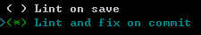

## DAY01-黑马头条后台管理项目

### 01-项目-简单介绍

- 黑马头条，今日头条：看新闻 浏览文章 ，数据从何而来，对应的后台管理系统，对文章，评论，用户，素材。
- 主要功能：
  - 登录
  - 首页
  - 发布文章
  - 内容管理
  - 粉丝管理
  - 评论管理
  - 素材管理

### 02-项目-准备工作

- 需要图片素材
- 需要接口文档
- 需要使用技术
  - vue 基础
  - vue-cli 3.x
  - vue-router 基于vue的插件
  - axios  
  - element-ui  饿了么UI
    - UI  用户界面
    - bootstrap 是一个基于jquery的UI框架
    - element-ui 是一个基于vue的UI组件库称为：UI框架
- 需要版本工具
  - git 分布式版本控制系统   github  共享仓库托管平台

### 03-项目-初始化

- 使用vue-cli 3.0 创建项目

```sh
vue create hm74-toutiao
```

- 根据自己的项目的依赖需求，选择需要的插件和工具。




​	                                                       							

注意：最后的对话的意思，问你是否保存刚才的操作记录，以便于以后创建一个相同的项目。

### 04-项目-结构说明

- 对生成的结构了解


- src 下的目录创建

```sh
├─api   # 接口
├─assets  # 静态文件
│  ├─fonts 
│  └─images
├─components # 公用级别组件
├─directives # 指令
├─filters    # 过滤器
├─router     # 路由
├─styles     # less样式
└─views      # 路由级别组件
└─App.vue    # 根组件
└─main.js    # 入口
```

### 05-项目-分支管理

第一件事件：把本地仓库提交到远程仓库（github）

```sh
# 在github创建一个远程仓库（空仓库）
# 本地已经有一个仓库了，但是刚才修改了一些文件。
git add .
git commit -m 'initial'
# 推送远程仓库
# 1. 给远程仓库的地址 取别名
# 2. 按照别名推送master分支
git remote add origin git@github.com:zhousg/hm74-toutiao.git
git push -u origin master
```

第二件事件：分支作用

- 一个人同时进行多个功能的开发
- 多个人同时进行多个功能的开发（协同开发）
- 对项目的功能模块进行维护
  - 如果开发登录功能
  - 创建一个login分支
  - 切换到login分支进行coding（多次提交）
  - 切换到master分支去合并login分支代码


### 06-项目-使用element-ui

- 怎么使用一个UI框架，看文档。

- 至少知道，包含哪些功能。

- 文档：https://element.eleme.cn/#/zh-CN

- 在项目中去使用element-ui的步骤：

  - 安装：`npm i element-ui -S`   
    - -S 是 --save 的简写  把安装的包记录在生产依赖  如果是npm5.0以上默认 -S
    - -D 是 --save-dev 的简写  把安装的包记录在开发依赖
  - 引入：完整引入

  ```js
  // 导入包
  // 导入样式
  import ElementUI from 'element-ui';
  import 'element-ui/lib/theme-chalk/index.css';
  // 注册到VUE实例
  Vue.use(ElementUI);
  ```


### 07-项目-配置vscode的eslint插件

- 目的：检查代码风格（风格错误提示）  当自动保存自动修复

- 在vscode的扩展选项中去搜索：eslint的插件

- 在vscode的设置中，打开设置json文件，添加一段eslint相关配置

  ```json
  "eslint.validate": [
      "javascript",
      "javascriptreact",
      {
          "language": "html",
          "autoFix": true
      },
      {
          "language": "vue",
          "autoFix": true
      }
  ],
  "eslint.autoFixOnSave": true
  ```

### 08-项目-使用vue-router

安装：npm i vue-router

引入：router/index.js 去做

注册：导入vue对象 然后才能注册 Vue.use()

初始化路由对象（路由规则配置）：

```js
import Vue from 'vue'
import VueRouter from 'vue-router'
Vue.use(VueRouter)
const router = new VueRouter({
    routes:[] // 配置路由规则
})
export default router
```

挂载：main.js

```js
new Vue({
    router:'实例的路由对象'
})
```

### 09-项目-路由规则分析


约定路由规则：

| path     | 功能     | 备注     |
| -------- | -------- | -------- |
| /login   | 登录     | 一级路由 |
| /        | 首页     | 一级路由 |
| /publish | 发布文章 | 二级路由 |
| /article | 文章列表 | 二级路由 |
| /comment | 评论     | 二级路由 |
| /image   | 素材     | 二级路由 |
| /fans    | 粉丝     | 二级路由 |
| /setting | 个人设置 | 二级路由 |
| /welcome | 欢迎     | 二级路由 |


### 10-登录模块-路由及组件创建

配置路由规则：router/index.js

```js
routes: [
    { name: 'login', path: '/login', component: Login }
  ]
```


创建组件：views/login/index.vue

```html
<template>
  <div class='container'>
    Login
  </div>
</template>

<script>
export default {}
</script>

<style scoped lang='less'></style>

```


准备渲染一级路由的位置：App.vue

```html
<div id="app">
    <!-- 一级路由对应组件渲染的位置 -->
    <router-view></router-view>
  </div>
```


### 11-登录模块-基础布局

- 全屏容器
- 卡片（居中）

```js
<template>
  <div class='login-container'>
    <el-card class="login-box">
      
    </el-card>
  </div>
</template>

<script>
export default {}
</script>

<style scoped lang='less'>
.login-container{
  width: 100%;
  height: 100%;
  position: absolute;
  left: 0;
  top: 0;
  // cover 铺面容器 多余的裁剪   contain 在容器内容完全显示图片
  // 背景图定位 / 背景图尺寸
  background:url(../../assets/images/login_bg.jpg) no-repeat center / cover;
  .login-box{
    width: 400px;
    height: 300px;
    position: absolute;
    left: 50%;
    top: 50%;
    transform: translate(-50%,-50%);
    img{
      display: block;
      width: 200px;
      margin: 10px auto;
    }
  }
}
</style>

```


### 12-登录模块-绘制表单

### 13-登录模块-添加校验

### 14-登录模块-整体校验

### 15-登录模块-进行登录

### 16-登录模块-404页面


