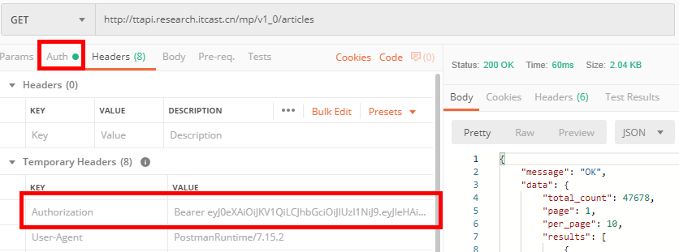
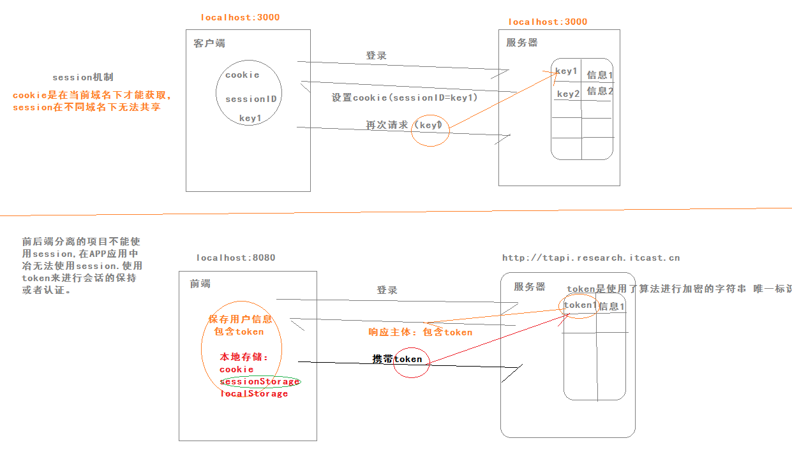

### 01-反馈

| 姓名 | 意见或建议                                                   |
| ------- | ------------------------------------------------------------ |
| ***  | 分支提交忘了怎么弄了，没提交能接着写代码吗？                 |
| ***  | 继续保持                                                     |
| ***  | 老师登录卡片，复选框里写:value="true"只有选中状态阿，这样就不能切换没有选中该状态了啊 |
| ***  | 讲真的，你没有我方雨涵帅                                     |
| ***  | 下面我淑淑为大家带来一首歌,在这燥热的夏日给大家带来一丝凉意  |
| ***  | 非常好                                                       |
| ***  | hao                                                          |
| ***  | 如果:value='true',那么checkbox的value值(数据)在哪里储存?     |
| ***  | len: 6 len什么意思 (/^1[3-9]\d{9}$/.test(value)) 。test什么意思 (rule, value, callback) 这三个详细说说呗 this.$message.error 我光写this.$message也好使 |
| ***  | 老师很帅，讲的非常好，每一个知识点都讲的很清楚               |
| ***  | 账号密码有问题,登不上去                                      |
| ***  | 黑化肥发灰会挥发，灰化肥挥发会发黑                           |
| ***  | 晕晕乎乎,云里雾里                                            |
| *** | 老师 登陆页 下面那个复选框同意按钮 点击 会发生 后面的字抖动 怎么解决 |

### 02-回顾

- 提交分支：
  - git push 远程仓库的地址  分支名称
- 校验
  - len element-ui提供的校验规则
  - test 是正则提供的函数  判断字符串是否满足你的正则格式
  - function(rule,value,callback){}  value数据  callback 校验完毕调用的回调函数

回顾：

- 验证
  - 单个表单元素的校验
  - 自定义校验
  - 整体表单校验
- 登录
- axios基本使用
- 首页
  - 布局
  - 头部
  - 导航菜单

内容：


### 03-首页-导航菜单路由功能

- 开启路由功能：
  - 使用一个属性即可，router属性给el-menu
  - el-menu-item的index的值，改成我们约定好的路径

```html
<el-menu
        router
        style="border-right:none"
        default-active="/"
        background-color="#002033"
        text-color="#fff"
        active-text-color="#ffd04b"
        :collapse="collapse"
        :collapse-transition="false"
      >
        <el-menu-item index="/">
          <i class="el-icon-s-home"></i>
          <span slot="title">首页</span>
        </el-menu-item>
        <el-menu-item index="/article">
          <i class="el-icon-document"></i>
          <span slot="title">内容管理</span>
        </el-menu-item>
        <el-menu-item index="/image">
          <i class="el-icon-picture"></i>
          <span slot="title">素材管理</span>
        </el-menu-item>
        <el-menu-item index="/publish">
          <i class="el-icon-s-promotion"></i>
          <span slot="title">发布文章</span>
        </el-menu-item>
        <el-menu-item index="/comment">
          <i class="el-icon-chat-dot-round"></i>
          <span slot="title">评论管理</span>
        </el-menu-item>
        <el-menu-item index="/fans">
          <i class="el-icon-present"></i>
          <span slot="title">粉丝管理</span>
        </el-menu-item>
        <el-menu-item index="/setting">
          <i class="el-icon-setting"></i>
          <span slot="title">个人设置</span>
        </el-menu-item>
      </el-menu>
```


### 04-首页-404页面&欢迎页面

- 欢迎页面
  - 内容是属于首页的，而首页本身就是，路由对应的组件，内容二级路由对应的组件。

修改首页路由配置：

```js
{
      path: '/',
      component: Home,
      children: [
        { name: 'welcome', path: '/', component: Welcome }
      ]
    }
```

组件：

```html
<template>
  <div class='container'>
    
  </div>
</template>

<script>
export default {}
</script>

<style scoped lang='less'>
.container{
  text-align: center;
}
</style>

```

- 404页面
  - 当我们约定的路由规则，无法去匹配用户的地址，认为是404路径。
  - 当路径发送改变，根据你定义路由规则的顺序去匹配，走到最后，发现没有对应的规则，做404处理。

```js
// ... 很多规则
{ name: '404', path: '*', component: NotFound }
```

组件：

```html
<template>
  <div class="container"></div>
</template>

<script>
export default {}
</script>

<style scoped lang='less'>
.container {
  position: absolute;
  left: 0;
  top: 0;
  width: 100%;
  height: 100%;
  background: url(../../assets/images/404.png) no-repeat center / cover;
}
</style>

```


### 05-接口-postman工具

- 测试任何请求方式的接口 （get,post,put,delete,patch）
  - 登录
  - 内容列表



结论：

在以后的调用接口的时候，在头部加上 Authorization ，字段值的格式：（Bearer + 空格 + token字符）

### 06-接口-token令牌




### 07-登录-保持会话状态

```js
// TODO 2. 保存用户的信息  用来判断登录的状态
// sessionStorage BOM对象  全局对象 作用是保存数据
// 是有有效期，当你关闭浏览后就失效
// sessionStorage.setItem(key,value) 存储数据 value字符串
// sessionStorage.getItem(key) 获取数据
// sessionStorage.removeItem(key) 删除数据
// sessionStorage.clear() 清空所有的数据
window.sessionStorage.setItem('hm74-toutiao', JSON.stringify(res.data.data))
```

### 08-登录-拦截未登录路由

- 根据sessionStorage是否存储了用户信息，来判断之前是否登录过。
- 除了登录页面访问不需要验证登录状态，其他页面的访问都需要校验是否登录。

效果：

- 路由地址 /login  放行
- 路由地址 不是/login 但是存储了用户信息  放行
- 路由地址 不是/login 但是没有存储用户信息  拦截到登录页面 /login

vue-router 导航守卫：

- 前置守卫
- 后置钩子

```js
const router = new VueRouter({ ... })
router.beforeEach((to, from, next) => {
  // ... 每一次的跳转路由会执行这个函数
  // to 目标路由对象  from 当前路由对象  to.path 目标路径
  // next() 放行  next('/login') 拦截     
})
```

自己的代码：

```js
// 加上前置守卫
router.beforeEach((to, from, next) => {
  if (to.path === '/login') return next()
  const user = window.sessionStorage.getItem('hm74-toutiao')
  if (user) return next()
  next('/login')
})
```


### 09-axios-默认配置选项

- 痛点：
  - 地址栏太长，后期不好维护。
  - 所有的接口token需要在头部携带

- axios配置
  - 基准路径  baseURL
  - 头部信息  headers

```js
// 导入axios
import axios from 'axios'
// 基准路径
axios.defaults.baseURL = 'http://ttapi.research.itcast.cn/mp/v1_0/'
// token认证
axios.defaults.headers = {
  Authorization: 'Bearer ' + JSON.parse(window.sessionStorage.getItem('hm74-toutiao')).token
}
Vue.prototype.$http = axios
```


### 10-axios-提取与封装

```js
// 配置axios
import axios from 'axios'

const instance = axios.create({
  // 配置对象  基准路径  头部信息
  baseURL: 'http://ttapi.research.itcast.cn/mp/v1_0/',
  headers: {
    Authorization: 'Bearer ' + JSON.parse(window.sessionStorage.getItem('hm74-toutiao')).token
  }
})

export default instance
```


### 11-axios-请求拦截器

- token在出去登录的所有请求都需要携带。`
- 不能在页面初始化的时候去获取token。
- 在请求前获取token，再去发请求即可。

axios提供了请求拦截器，类似理解为和jquery.ajax的beforeSend是一个意思。

示例代码

```js
// 添加请求拦截器
axios.interceptors.request.use(function (config) {
    // 给config追加一个 token认证信息
    // 在头部加上 Authorization ，字段值的格式：（Bearer + 空格 + token字符）
    return config;
}, function (error) {
    // Promise.reject(error); 是返回一个一定错误的promise对象
    // Promise.resovle(); 是返回一个一定成功的promise对象
    // new Promise() 可能是成功的可能是失败的
    return Promise.reject(error);
});
```

自己的代码：

```js
// 请求拦截
instance.interceptors.request.use(config => {
  // 给头部加上认证信息
  const user = window.sessionStorage.getItem('hm74-toutiao')
  if (user) {
    config.headers = {
      Authorization: 'Bearer ' + JSON.parse(user).token
    }
  }
  return config
}, error => {
  return Promise.reject(error)
})

```

### 12-axios-响应拦截器

- token用于访问需要身份认证的普通接口，有效期2小时

- 做的事情：
  - 在后端响应之后(是失败的时候去做，任何接口请求失败的时候)
  - 获取错误状态码
  - 如果是401代码
  - 跳转去登录页面
  - 重新登录，获取有效的token

```js
// 添加响应拦截器
axios.interceptors.response.use(function (response) {
    return response;
  }, function (error) {
    // 对响应错误做点什么
    // 获取响应状态码  ---> 响应对象 ---> error.response
    // status === error.response.status
    return Promise.reject(error);
  });
```

自己的代码：

```js
// 响应拦截
instance.interceptors.response.use(response => response, error => {
  // 做一些事情
  if (error.response.status === 401) {
    // hash 哈希   是url后  #开始的字符串
    location.hash = '#/login'
  }
  return Promise.reject(error)
})
```


### 13-axios-结合async与await使用

- 在进行异步代码的编写的时候：
  - 使用的是回调函数，例如 jquery的ajax 例如 原生的xhr请求
  - 学会了promise对象，例如 axios 代码的可读性高一些
  - ES7的async和await 的使用，异步的编程使用同步的语法。

```js
    // 1. xhr 请求
    // const xhr = new XMLHttpRequest()
    // xhr.open('get','http://localhost:3000/a')
    // xhr.send()
    // xhr.onload = function (){
    //   console.log(xhr.responseText)
    //   const xhr2 = new XMLHttpRequest()
    //   xhr2.open('get','http://localhost:3000/b')
    //   xhr2.send()
    //   xhr2.onload = function(){
    //     console.log(xhr2.responseText)
    //   }
    // }
    // 2. promise
    const axios = function (url) {
      return new Promise((resolve, reject) => {
        const xhr = new XMLHttpRequest()
        xhr.open('get', url)
        xhr.send()
        xhr.onload = function () {
          resolve(xhr.responseText)
        }
        xhr.onerror = function () {
          reject(new Error('请求失败'))
        }
      })
    }
    // promise的使用
    // axios('http://localhost:3000/a').then(res=>{
    //   console.log(res)
    //   return axios('http://localhost:3000/b')
    // }).then(res=>{
    //   console.log(res)
    // })

    // 3. async 和 await 使用
    // 3.1 必须和promise对象一起使用
    // 3.2 使用await关键字，包含这些关键字的函数 必须是async修饰
    // await is only valid in async function
    // 3.3 使用await关键字修饰的promise调用 返回值就是成功的结果
    const fn = async function () {
      const a = await axios('http://localhost:3000/a')
      const b = await axios('http://localhost:3000/b')
      console.log(a,b)
    }
    fn()
```


### 14-内容管理-组件与路由


### 15-内容管理-筛选条件布局


### 16-内容管理-查询结果布局


### 17-内容管理-列表


### 18-内容管理-搜索


### 19-内容管理-分页


### 20-内容管理-删除