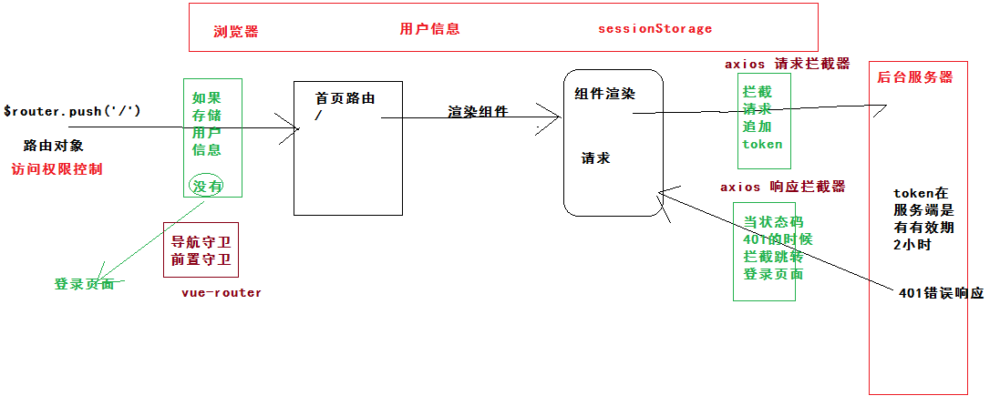

## 黑马头条后台管理项目-DAY04

### 01-反馈

| 姓名   | 意见或建议                                                   |
| ------ | ------------------------------------------------------------ |
| 111111 | 室友想要我的代码，我到底给不给？                             |
| ***    | 今天的有点难                                                 |
| ***    | 有没有人说你长得像 F4里面的 言承旭                           |
| ***    | 感觉今天东西挺多的,还没吸收,老师能课前回顾知识时细些。老师token过期时，当前账号携带的token字符串是在后台改变了吗？ |
| ***    | 老师的声音很像我喜欢的b站up主 阿斗归来了~~~ 是影视方面的up主 听课有一种听故事的感觉 是一种享受啊 |
| ***    | 非常好                                                       |
| ***    | 内容有点多,不好消化...这点东西现在有您带着还能懂,以后出新东西了,我们自己看文档这也看不懂啊,到时候绝对不会用 |
| ***    | 懵X                                                          |
| ***    | 连心爱的人都留不住，代码写的再6又怎样。。。。。              |
| ***    | 淑淑老师 下午好                                              |
| ***    | 老师，token有点不太懂，再给讲讲吧                            |
| ***    | 用户进行登录会不会都有一个token,还有响应拦截器没有听太明白   |
| 9999   | 对于不是公共的请求头类型，如何在发送axios时满足其接口要求的请求头类型设置 |

### 02-回顾

- 对于不是公共的请求头类型，如何在发送axios时满足其接口要求的请求头类型设置

  - 我们配置了一个公用的axios模块，配置了统一的头部信息
  - 单独设置头部：

  ```js
  // axios.get()  axios.post() axios.delete() axios.put()
  // 统一的写法
  axios({
      method:'get',
      url:'',
      data:{},
      params:{},
      headers:{
          'Content-Type':'application/x-www-form-urlendcoded'
      }
  })
  ```

- 回顾拦截




### 03-axios-结合async与await使用

- 使用的时候约定：
  - 使用await关键字来修饰promise对象，直接返回成功时候结果
  - 使用await关键字，必须在async修饰的函数内
  - await修饰的promise对象的执行，阻碍程序的运行
  - async修饰的函数，是不会阻碍程序的运行
  - 问题：那错误的时候怎么处理呢？？？ (js语法，捕获异常，处理异常)
  - try{ 业务逻辑 }catch(err){ 处理错误 }

```js
this.$refs.loginForm.validate(async valid => {
        if (valid) {
          // 发请 promise对象 给你发请求
          // try{ 业务逻辑 }catch(err){ 处理错误 }
          try {
            const res = await this.$http.post('authorizations', this.loginForm)
            window.sessionStorage.setItem('hm74-toutiao', JSON.stringify(res.data.data))
            this.$router.push('/')
          } catch (err) {
            this.$message.error('手机号或验证码错误')
          }
        }
      })
```


### 04-首页-用户信息&退出登录

```js
      avatar: '',
      name: ''
    }
  },
  created () {
    const user = JSON.parse(window.sessionStorage.getItem('hm74-toutiao'))
    this.avatar = user.photo
    this.name = user.name
  },
```

```js
 // 1. 使用的是 click 事件，dom的原生事件。
    // 2. 此时你绑定了一个原生事件给 组件el-dropdown-item
    // 3. 组件解析过后 这个标签是不存在 事件绑定无效
    // 4. 事件修饰符：@click.prevent 阻止浏览器默认行为  @click.native 绑定原生的事件
    setting () {
      this.$router.push('/setting')
    },
    logout () {
      // 清除sessionStorage中的hm74-toutiao
      window.sessionStorage.removeItem('hm74-toutiao')
      this.$router.push('/login')
    }
```

使用组件提供的方案：

```html
 <el-dropdown style="float:right" @command="handleCommand">
          <span class="el-dropdown-link">
            
            <b style="vertical-align:middle;padding-left:5px">{{name}}</b>
            <i class="el-icon-arrow-down el-icon--right"></i>
          </span>
          <el-dropdown-menu slot="dropdown">
            <el-dropdown-item icon="el-icon-setting" command="setting">个人设置</el-dropdown-item>
            <el-dropdown-item icon="el-icon-unlock" command="logout">退出登录</el-dropdown-item>
          </el-dropdown-menu>
        </el-dropdown>
```

js逻辑

```js
setting () {
      this.$router.push('/setting')
    },
    logout () {
      // 清除sessionStorage中的hm74-toutiao
      window.sessionStorage.removeItem('hm74-toutiao')
      this.$router.push('/login')
    },
    handleCommand (command) {
      // command就是点击的选项中的command的值  setting/logout
      this[command]()
      // command === setting ===> this.setting()
      // command === logout ===> this.logout()
    }
```


### 05-内容管理-组件与路由

```js
{ name: 'article', path: '/article', component: Article }
```

```html
<template>
  <div class='container'>Article</div>
</template>

<script>
export default {}
</script>

<style scoped lang='less'></style>

```

- 优化切换路由后，切换默认激活的菜单。
- default-active="/"  首页   default-active="/article"  内容管理
- default-active动态绑定  值是：当前路由的路径
- :default-active="当前路由的路径"    当前路由的路径 === $route.path

### 06-内容管理-筛选条件布局

```html
<!-- 筛选表单 -->
      <el-form :model="reqParams" size="small" label-width="80px">
        <el-form-item label="状态：">
          <el-radio-group v-model="reqParams.status">
            <el-radio :label="null">全部</el-radio>
            <el-radio :label="0">草稿</el-radio>
            <el-radio :label="1">待审核</el-radio>
            <el-radio :label="2">审核通过</el-radio>
            <el-radio :label="3">审核失败</el-radio>
          </el-radio-group>
        </el-form-item>
        <el-form-item label="频道：">
          <el-select v-model="reqParams.channel_id">
            <el-option
              v-for="item in channelOptions"
              :key="item.id"
              :label="item.name"
              :value="item.id"
            ></el-option>
          </el-select>
        </el-form-item>
        <el-form-item label="日期：">
          <el-date-picker
            v-model="dateValues"
            type="daterange"
            range-separator="至"
            start-placeholder="开始日期"
            end-placeholder="结束日期"
          ></el-date-picker>
        </el-form-item>
        <el-form-item>
          <el-button type="primary">筛选</el-button>
        </el-form-item>
      </el-form>
    </el-card>
```

数据：

```js
 data () {
    return {
      // 提交后的筛选条件数据
      reqParams: {
        // 默认数据 '' 与 null 区别
        // 如果是 null 该字段是不会提交给后台的。
        status: null,
        channel_id: null,
        begin_pubdate: null,
        end_pubdate: null
      },
      // 频道的选项数组
      channelOptions: [{ name: 'java', id: 1 }],
      // 日期数据
      dateValues: []
    }
  }
```

###07-vue-基础-插槽

> 可以封装组件的时候，使用插槽功能，提高组件的复用度。

当使用一个组件，组件的内容需要，自定义的时候，使用插槽。

- 默认插槽
  - 当你的自定义内容 只有一个的时候。

```html
<slot></slot>
```

- 备用内容
  - 当你有可能不传入自定义内容的时候，使用备用内容。

```html
<slot>内容</slot>
```

- 具名插槽
  - 当你要同时插入多处内容的时候，使用具名插槽。

```html
<p><slot name="content">内容</slot></p>
<p><slot name="footer">底部</slot></p>
```

插入内容：

```html
<template slot="content">内容1</template>
<template slot="footer">底部1</template>
```

- 作用域插槽
  - 当使用该组件的时候，在插槽上要使用，组件内部的数据，使用作用域插槽。

```html
<p><slot name="content" :test="innerData">内容</slot></p>
```

使用组件插槽的时候：

```html
<!-- scope 收集了该插槽上所有的自定义属性的数据 -->
<!-- scope 是一个对象 包含了插槽上的所有数据  -->
<template slot="content" slot-scope="scope">内容1 {{scope.test}}</template>
```

以上的写法是vue 2.6.0之前的写法。

```html
<template v-slot:content="scope">内容1 {{scope.test}}</template>
```


###07-内容管理-面包屑组件封装

```html
<template>
  <el-breadcrumb separator-class="el-icon-arrow-right">
    <el-breadcrumb-item :to="{ path: '/' }">首页</el-breadcrumb-item>
    <el-breadcrumb-item>
      <slot></slot>
    </el-breadcrumb-item>
  </el-breadcrumb>
</template>

<script>
export default {}
</script>

<style scoped lang='less'></style>

```

使用

```js
import MyBread from '@/components/my-bread.vue'
export default {
  components: { MyBread },
```

```html
<my-bread>粉丝管理</my-bread>
```

###07-vue-基础-插件封装

插件：

```js
// 封装一个vue的插件  完成当前文件夹在所有的组件全局注册
// 当导入这个模块 使用Vue.use(使用这个模块) Vue会调用install函数  默认传人Vue对象
import MyBread from '@/components/my-bread.vue'
export default {
  install (Vue) {
    // 使用Vue对象去做你的业务即可
    // 进行组件的注册
    Vue.component(MyBread.name, MyBread)
    // ... 进行组成即可
  }
}

```

安装：

```js
import componnets from '@/components'

Vue.use(componnets)
```


### 08-内容管理-查询结果布局


### 09-内容管理-列表


### 10-内容管理-搜索


### 11-内容管理-分页


### 12-内容管理-删除-js数字最大安全值


### 13-内容管理-删除-响应无内容处理