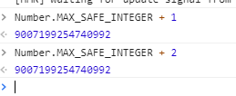
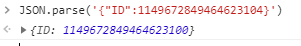

## 黑马头条后台管理项目-DAY05

### 01-反馈

| 姓名   | 意见或建议                                                   |
| ------ | ------------------------------------------------------------ |
| ***    | 删库跑路，一气呵成                                           |
| ***    | 信球                                                         |
| ***    | shu..shu.. 这有点炸......                                    |
| ***    | hai you huo zhe de me                                        |
| ***    | 加油加油加油！！！！！！！！！！！！！！！！                 |
| ***    | 大郎的故事告诉我们，千万不要买高配                           |
| ***    | 非常好                                                       |
| ***    | 还记得大明湖畔的夏雨荷吗?你看,天上那朵云像不像你唱歌的样子?哦!对哦!我不知道像不像,因为没有看见过你唱歌的亚子!so... |
| ***    | 其实吧 自己一块一块做还是会的 搞在一起就不咋会楼 感觉学这个就是找然后复制粘粘然后改 写完之后发现还是啥都不会。 |
| ***    | 尊重老师,换位思考一下.                                       |
| ***    | 插槽不太懂                                                   |
| ***    | 就不能给我一次机会吗，难道非得让我接受人民的审判吗，学习要想好，踏踏实实搞，天天作报告，学习还好不了，好不了啊好不了，好 不 了 呵呵 |
| ***    | 没对象可以var一个对象啊! 一个不够就多var几个!                |
| ***    | 实不相瞒，听不懂                                             |
| ***    | channel_id为什么可以接收到id值，this[command]()这里用中括号是属性的用法吗 |
| ***    | 蜀道难,难于上青天                                            |
| 123456 | 怎么使用watch监听，组件中data里面的对象类型数据              |

### 02-回顾

- async await

  - await修饰promise对象的，会返回promise的成功结果
  - 是会阻碍程序运行，同步的操作。
  - 外层函数必须是async来修饰
  - 是不会阻碍程序的运行，异步操作。

- 插槽

  - 默认插槽
    - slot标签
    - 当只有一处内容需要自定义的时候

  ```html
  <slot></slot>
  ```

  - 备用内容
    - slot标签的默认内容
    - 当你需要没有插入内容的时候需要默认内容

  ```html
  <slot>备用内容</slot>
  ```

  - 具名插槽
    - 给slot标签加name属性
    - 当你需要插入多处自定义内容 的时候

  ```html
  <slot name="header"></slot>
  ```

  ```html
  <template slot="header"></template>
  ```

  - 作用域插槽
    - 组件内部的数据提供给组合件外部使用，slot标签绑定属性
    - 当需要组件内部数据的时候

  ```html
  <slot name="header" :text="'abc'"></slot>
  ```

  ```html
  <template slot="header" slot-scope="scope">{{scope.text}}</template>
  ```

  2.6.0 新的语法

  ```html
  <template v-slot:header="scope">{{scope.text}}</template>
  ```

- 插件

  - 不想在main.js写过多的逻辑代码
  - 将来有很多个组件需要注册，打算把组件的全局注册封装在你插件内。
  - 怎么写插件：
    - 导出的内容，一个对象，对象中有一个install函数
    - 当使用Vue.use(模块)的时候，调用install函数，默认传入Vue对象，基于Vue对象，扩展Vue功能
    - 全局注册组件

```js
export default {
    install (Vue ){
        // 基于 Vue 扩展Vue功能
    }
}
```


### 03-内容管理-频道下拉渲染

- 获取后台的数据，设置给下拉选项数据，channelOptions 。

```js
 created () {
    // 获取频道数据
    this.getChannelOptions()
  },
```

```js
 // 获取频道数据
    async getChannelOptions () {
      // res ===> {data:响应内容}  ===> {data:{data:{channels:[{id,name},...]}}}
      // 解构赋值 一层 const {data} = res
      // 解构赋值 二层 const {data:{data:data}} = res
      const { data: { data } } = await this.$http.get('channels')
      this.channelOptions = data.channels
    }
```


### 04-内容管理-查询结果布局

```html
<!-- 结果区域 -->
    <el-card>
      <div slot="header">
        根据筛选条件共查询到
        <b>0</b> 条结果：
      </div>
      <el-table :data="articles">
        <el-table-column label="封面"></el-table-column>
        <el-table-column label="标题"></el-table-column>
        <el-table-column label="状态"></el-table-column>
        <el-table-column label="发布时间"></el-table-column>
        <el-table-column label="操作"></el-table-column>
      </el-table>
      <div class="box">
        <el-pagination background layout="prev, pager, next" :total="1000"></el-pagination>
      </div>
    </el-card>
```


### 05-内容管理-列表渲染

- 获取数据

```js
    // 获取文件列表数据
    async getArticles () {
      // post 传参  post('url',{参数对象})
      // get 传参 get('url?key=value&....') get('url',{params:{参数对象}})
      const { data: { data } } = await this.$http.get('articles', { params: this.reqParams })
      this.articles = data.results
    }
```

- 渲染列表
  - 列的数据  使用键名  获取到数据   只能显示原生的数据
  - 使用作用域插槽

```html
<el-table :data="articles">
        <el-table-column label="封面">
          <template slot-scope="scope">
            <el-image :src="scope.row.cover.images[0]" style="width:100px;height:75px;">
              <div slot="error">
                
              </div>
            </el-image>
          </template>
        </el-table-column>
        <el-table-column label="标题" prop="title"></el-table-column>
        <el-table-column label="状态">
          <template slot-scope="scope">
            <el-tag v-if="scope.row.status === 0" type="info">草稿</el-tag>
            <el-tag v-if="scope.row.status === 1" >待审核</el-tag>
            <el-tag v-if="scope.row.status === 2"  type="success">审核通过</el-tag>
            <el-tag v-if="scope.row.status === 3" type="warning">审核失败</el-tag>
            <el-tag v-if="scope.row.status === 4"  type="danger">已删除</el-tag>
          </template>
        </el-table-column>
        <el-table-column label="发布时间" prop="pubdate"></el-table-column>
        <el-table-column label="操作" width="120">
          <template slot-scope="scope">
            <el-button icon="el-icon-edit" plain type="primary" circle></el-button>
            <el-button icon="el-icon-delete" plain type="danger" circle></el-button>
          </template>
        </el-table-column>
      </el-table>
```


### 06-内容管理-搜索功能

- 在你选择时间的时候：
  - 获取你选择的时间，设置给 begin_pubdate end_pubdate

```html
<el-date-picker
            value-format="yyyy-MM-dd"
            @change="changeDate"
            v-model="dateValues"
            type="daterange"
            range-separator="至"
            start-placeholder="开始日期"
            end-placeholder="结束日期"
          ></el-date-picker>
```

```js
// 选择时间处理函数
    changeDate (values) {
      this.reqParams.begin_pubdate = values[0]
      this.reqParams.end_pubdate = values[1]
    },
```

- 在点击筛选按钮的时候：
  - 根据筛选条件，重新获取数据，即可。

```html
<el-button type="primary" @click="search()">筛选</el-button>
```

```js
 // 搜索
    search () {
      this.getArticles()
    },
```


### 07-内容管理-分页功能

- 依赖数据

  - 每一页多少条
  - 总共多少条
  - 总页数 = Math.ceil(总共多少条/每一页多少条)
  - 去渲染分页组件

- 进行分页切换功能

  ```html
          <el-pagination
            background
            layout="prev, pager, next"
            @current-change="pager"
            :current-page="reqParams.page"
            :page-size="reqParams.per_page"
            :total="total"
          ></el-pagination>
  ```

  - @current-change  改变页码触发的事件
  - :current-page 当前页面
  - :page-size 每一页多少条
  - :total 一共多少条

  ```js
   // 分页
      pager (newPage) {
        // 提交当前页码给后台 才能获取对应的数据
        this.reqParams.page = newPage
        this.getArticles()
      },
  ```

### 08-内容管理-删除-js数字最大安全值

- js的数字有  最大安全数值

  - 2的53次方

  - Number.MAX_SAFE_INTEGER

  - 在运算 或 json对象转换的时候会有误差

  - 运算的时候：

    

  - json对象转换的时候：

    

- json-bigint  npm的包
  - 看文档 
  - npm i json-bigint
  - import JSONBig from 'json-bigint'
  - JSONBig .parse('json数据')

- 在哪里使用：
  - 原来 是axios默认转换的数据  JSON.parse()
  - 现在 使用自定义的方式来转换数据

```js
 // `transformResponse` 在传递给 then/catch 前，允许修改响应数据
  transformResponse: [function (data) {
    // 对 data 进行任意转换处理

    return data;
  }],
```


### 09-内容管理-删除-响应无内容处理

- 响应没有内容：
  - 在axios的响应拦截使用过响应对象
  - 在转换格式的配置项使用了响应对象

```js
transformResponse: [(data) => {
    // 对 data 进行任意转换处理
    // data 应该是 null 使用JSONBig转换null会出现异常
    if (data) {
      return JSONBig.parse(data)
    }
    return data
  }]
```

```js
instance.interceptors.response.use(response => response, error => {
  // 做一些事情
  if (error.response && error.response.status === 401) {
    // hash 哈希   是url后  #开始的字符串
    location.hash = '#/login'
  }
  return Promise.reject(error)
})

```


### 10-内容管理-编辑-传参跳转

```html
            <el-button @click="edit(scope.row.id)" icon="el-icon-edit" plain type="primary" circle></el-button>

```

```js
 // 编辑
    edit (id) {
      this.$router.push(`/publish?id=${id}`)
    },
```


### 11-内容管理-频道组件封装

- v-model的语法糖

```html
<input type="text" v-model="username" />
<!-- v-model === v-bind:value="username"  v-on:input="把改变的内容赋值给username"  -->
```

- 父传子

```html
<!-- 父组件 -->
<com-a :text="'父组件数据'"></com-a>
```

```js
// 子组件
export default {
	props:['text']	
}
```

- 子传父
  - 绑定自定义事件   @input="fn"
  - 触发自定义事件    vue实例$emit(‘input’,数据)
  - 事件给谁绑定的，谁来触发。

```html
<my-channel @input="fn"></my-channel>
```

```js
fn (data) {
      console.log('fn')
      console.log(data)
    }
```

在子组件

```js
 // 提交数据给父组件
 this.$emit('input', this.childText)
```


**进行组件的封装：**

- 封装功能
- 支持v-model指令

```js
<template>
  <el-select :value="value" @change="fn">
    <el-option v-for="item in channelOptions" :key="item.id" :label="item.name" :value="item.id"></el-option>
  </el-select>
</template>

<script>
export default {
  name: 'my-channel',
  props: ['value'],
  data () {
    return {
      channelOptions: []
    }
  },
  created () {
    // 获取频道数据
    this.getChannelOptions()
  },
  methods: {
    fn (value) {
      // value 你选中的值
      this.$emit('input', value)
    },
    // 获取频道数据
    async getChannelOptions () {
      // res ===> {data:响应内容}  ===> {data:{data:{channels:[{id,name},...]}}}
      // 解构赋值 一层 const {data} = res
      // 解构赋值 二层 const {data:{data:data}} = res
      const {
        data: { data }
      } = await this.$http.get('channels')
      this.channelOptions = data.channels
    }
  }
}
</script>

<style scoped lang='less'></style>

```

```html
<!-- :value="reqParams.channel_id"  @input="把改变的数据设置给reqParams.channel_id" -->
          <my-channel v-model="reqParams.channel_id"></my-channel>
```

### 12-素材管理-组件与路由


### 13-素材管理-素材列表


### 14-素材管理-列表分页


### 15-素材管理-收藏素材功能


### 16-素材管理-删除素材功能


### 17-素材管理-上传素材功能