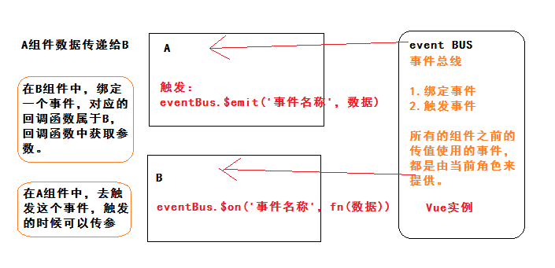

## 黑马头条后台管理项目-DAY08

### 01-反馈

| 姓名   | 意见或建议                                                   |
| ------ | ------------------------------------------------------------ |
| ***    | 给楼上冰箱点个赞👍                                            |
| ***    | 感觉有点蒙                                                   |
| ***    | 冰箱和冰淇淋分手了，冰淇淋夺门而出，在路上的时候它后悔了，它发现自己流了好多水，于是回去找冰箱，冰箱缓缓打开门，说：上来，自己冻... |
| ***    | 为啥有些绑定事件要加小括号( @change="search()"),有些事件不用( @current-change="pager") |
| ***    | 老师老师,我有不会的题,可以问你吗?嗯..想想...想..睡着了...    |
| ***    | 敌羞！吾去脱他衣！！！！                                     |
| ***    | 当初...谁和我说vue简单的???                                  |
| ***    | 代码太多了太多了，我已经坦然的放弃了，毕竟三分天注定，七分靠打拼，剩下140全靠队友赢，其他同学加油！ 同学看到你这段话我都哭了 没想到居然班里有这莫暖的人 |
| ***    | 哈哈哈哈哈哈哈哈哈哈                                         |
| ***    | 四十是四十，十四是十四，嘿嘿嘿嘿黑嘿黑嘿黑                   |
| ***    | 你还不唱歌吗？ 你在不唱 我学不进去了，你的歌声是我学习的动力 |
| ***    | 好烦哦 淑淑老师                                              |
| ***    | 有点难,有些难,敲不完敲不完敲不完敲不完,                      |
| ***    | 今天叙利亚的AK格外的烫手，对面美国人的冰镇可乐依旧是我可望不可即的梦，子弹从我头顶呼啸而过，我不知道这样的生活还能坚持多久。 每每想起在黑马敲代码的生活还是不禁有些怀念，虽然累，但是不用担心生命安全 |
| 123456 | 老师说的对，确实不能放弃。工作也只能靠自己，听到老师鼓励的话，我现在又充满的信心，充满了刚开始的激情，而且我现在内心又燃起了学习的欲望！不过，，还好我自制力强，欲望被我压下去了。。 |

### 02-回顾

- 绑定事件的时候需要指定函数 @click="fn"
  - fn什么时候加括号  如果是自己来传参数
  - fn什么时候不加括号   当你的函数需要默认传参
- 发布文章
  - 发布
    - 封装了一个组件（重点功能）
  - 修改
  - 细节：
    - 在文章修改的时候，切换到发布文章，组件不更新。
    - 使用侦听器，监听$route的变化，然后更新数据，组件也就更新。


### 03-评论管理-基础布局

```html
<template>
  <div class="container">
    <el-card>
      <div slot="header">
        <my-bread>评论管理</my-bread>
      </div>
      <!-- 列表 -->
      <el-table :data="comments">
        <el-table-column label="标题" width="400"></el-table-column>
        <el-table-column label="总评论数"></el-table-column>
        <el-table-column label="粉丝评论数"></el-table-column>
        <el-table-column label="状态"></el-table-column>
        <el-table-column label="操作" width="120"></el-table-column>
      </el-table>
      <!-- 分页 -->
      <el-pagination style="margin-top:20px" background layout="prev, pager, next" :total="1000"></el-pagination>
    </el-card>
  </div>
</template>

<script>
export default {
  data () {
    return {
      // 评论信息
      comments: []
    }
  }
}
</script>

<style scoped lang='less'></style>

```


### 04-评论管理-列表与分页

```html
<template>
  <div class="container">
    <el-card>
      <div slot="header">
        <my-bread>评论管理</my-bread>
      </div>
      <!-- 列表 -->
      <el-table :data="comments">
        <el-table-column label="标题" width="400" prop="title"></el-table-column>
        <el-table-column label="总评论数" prop="total_comment_count"></el-table-column>
        <el-table-column label="粉丝评论数" prop="fans_comment_count"></el-table-column>
        <el-table-column label="状态">
          <template slot-scope="scope">
            {{scope.row.comment_status?'正常':'关闭'}}
          </template>
        </el-table-column>
        <el-table-column label="操作" width="120">
           <template slot-scope="scope">
            <el-button v-if="!scope.row.comment_status" type="success" size="mini">打开评论</el-button>
            <el-button v-else type="danger" size="mini">关闭评论</el-button>
          </template>
        </el-table-column>
      </el-table>
      <!-- 分页 -->
      <el-pagination
      style="margin-top:20px"
      background
      layout="prev, pager, next"
      :page-size="reqParams.per_page"
      :current-page="reqParams.page"
      @current-change="pager"
      :total="total">
      </el-pagination>
    </el-card>
  </div>
</template>

<script>
export default {
  data () {
    return {
      // 评论信息
      comments: [],
      // 参数
      reqParams: {
        page: 1,
        per_page: 20,
        response_type: 'comment'
      },
      // 总条数
      total: 0
    }
  },
  created () {
    // 获取评论信息
    this.getComments()
  },
  methods: {
    // 分页
    pager (newPage) {
      this.reqParams.page = newPage
      this.getComments()
    },
    async getComments () {
      const { data: { data } } = await this.$http.get('articles', {
        params: this.reqParams
      })
      this.comments = data.results
      // 总条数
      this.total = data.total_count
    }
  }
}
</script>

<style scoped lang='less'></style>

```


### 05-评论管理-打开与关闭

```html
<el-table-column label="操作" width="120">
           <template slot-scope="scope">
            <el-button @click="toggleStatus(scope.row)" v-if="!scope.row.comment_status" type="success" size="mini">打开评论</el-button>
            <el-button @click="toggleStatus(scope.row)" v-else type="danger" size="mini">关闭评论</el-button>
          </template>
        </el-table-column>
```

```js
// 改变文章评论状态
    toggleStatus (row) {
      const text1 = '您确认要打开该文章的评论功能吗？'
      const text2 = '关闭评论功能后用户将无法对该文章进行评论，您确认要关闭该文章的评论功能吗？'
      this.$confirm(row.comment_status ? text2 : text1, '提示', {
        confirmButtonText: '确定',
        cancelButtonText: '取消',
        type: 'warning'
      }).then(async () => {
        const { data: { data } } = await this.$http.put('comments/status?article_id=' + row.id, {
          allow_comment: !row.comment_status
        })
        this.$message.success('修改文章评论状态成功')
        // 修改数据驱动视图更新
        row.comment_status = data.allow_comment
      }).catch(() => {})
    },
```


### 06-VUE基础-组件传值

- 父传子
- 子传父
- **非父子**



总结步骤：

事件总线

```js
// 事件总线  eventBus
// 导出一个VUE实例，让其他组件通过这个实例，绑定事件，触发事件，进行组件之间传值。
import Vue from 'vue'
export default new Vue({})

```

在B绑定事件

```js
// 绑定事件 接受A的数据
    eventBus.$on('fromA', (data) => {
      this.bData = data
    })
```

在A触发事件

```js
eventBus.$emit('fromA', this.aData)
```


### 07-个人设置-基础布局

- 基础布局
- 填充数据

```html
<template>
  <div class="container">
    <el-card>
      <div slot="header">
        <my-bread>个人设置</my-bread>
      </div>
      <el-row>
        <el-col :span="12">
          <!-- 表单 -->
          <el-form :model="userForm" label-width="120px">
            <el-form-item label="编号：">{{userForm.id}}</el-form-item>
            <el-form-item label="手机：">{{userForm.mobile}}</el-form-item>
            <el-form-item label="媒体名称：">
              <el-input v-model="userForm.name"></el-input>
            </el-form-item>
            <el-form-item label="媒体介绍：">
              <el-input v-model="userForm.intro" type="textarea" :rows="3"></el-input>
            </el-form-item>
            <el-form-item label="邮箱：">
              <el-input v-model="userForm.email"></el-input>
            </el-form-item>
            <el-form-item>
              <el-button type="primary">保存设置</el-button>
            </el-form-item>
          </el-form>
        </el-col>
        <el-col :span="12">
          <!-- 上传头像 -->
          <el-upload
            class="avatar-uploader"
            action="https://jsonplaceholder.typicode.com/posts/"
            :show-file-list="false"
          >
            
            <i v-else class="el-icon-plus avatar-uploader-icon"></i>
          </el-upload>
          <p style="text-align:center;font-size:14px;">修改头像</p>
        </el-col>
      </el-row>
    </el-card>
  </div>
</template>

<script>
export default {
  data () {
    return {
      userForm: {
        name: null,
        intro: null,
        email: null,
        id: null,
        mobile: null,
        photo: null
      }
    }
  },
  created () {
    // 获取用户信息
    this.getUserInfo()
  },
  methods: {
    async getUserInfo () {
      const { data: { data } } = await this.$http.get('user/profile')
      this.userForm = data
    }
  }
}
</script>

<style scoped lang='less'></style>

```


### 08-个人设置-修改基本信息

```html
<el-button type="primary" @click="updateUserInfo">保存设置</el-button>
```

```js
 // 修改用户信息
    async updateUserInfo () {
      const { data: { data } } = await this.$http.patch('user/profile', {
        name: this.userForm.name,
        intro: this.userForm.intro,
        email: this.userForm.email
      })
      this.$message.success('修改用户信息成功')
      // 1. 传当前修改的用户名称给hom组件   修改home组件的数据  用户名称
      eventBus.$emit('updateHeaderName', data.name)
      // 2. 更新本地存储的用户名称
      const userInfo = JSON.parse(window.sessionStorage.getItem('hm74-toutiao'))
      userInfo.name = data.name
      window.sessionStorage.setItem('hm74-toutiao', JSON.stringify(userInfo))
    }
```

### 09-个人设置-修改头像

```html
 <el-upload
            class="avatar-uploader"
            action=""
            :http-request="myUpload"
            :show-file-list="false"
          >
            
            <i v-else class="el-icon-plus avatar-uploader-icon"></i>
          </el-upload>
```

```js
 myUpload (data) {
      // 阿里百秀 自己来上传图片，使用xhr配合formData进行图片上传
      // 现在     自己来上传图片，使用axios配合formData进行图片上传
      // 获取图片对象  data.file 获取
      const formData = new FormData()
      formData.append('photo', data.file)
      this.$http.patch('user/photo', formData).then(res => {
        const url = res.data.data.photo
        // 修改头像成功  res.data.data.photo  地址
        this.$message.success('修改头像成功')
        this.userForm.photo = url
        // 1. 更新home组件的头像
        eventBus.$emit('updateHeaderPhoto', url)
        // 2. 更新本地存储的头像
        const userInfo = JSON.parse(window.sessionStorage.getItem('hm74-toutiao'))
        userInfo.photo = url
        window.sessionStorage.setItem('hm74-toutiao', JSON.stringify(userInfo))
      })
    },
```


### 10-粉丝管理-基础布局

```html
  <el-card>
      <div slot="header">
        <my-bread>粉丝管理</my-bread>
      </div>
      <el-tabs v-model="activeName" type="card">
        <el-tab-pane label="粉丝列表" name="list">
          <div class="fans-item" v-for="item in fans" :key="item.id">
            <el-avatar :size="80" :src="item.photo"></el-avatar>
            <p style="font-size:12px">{{item.name}}</p>
            <el-button plain type="primary" size="mini">+关注</el-button>
          </div>
          <div>
            <el-pagination
              v-if="total>reqParams.per_page"
              background
              layout="prev, pager, next"
              :total="total"
              :page-size="reqParams.per_page"
              :current-page="reqParams.page"
              @current-change="pager"
            ></el-pagination>
          </div>
        </el-tab-pane>
        <el-tab-pane label="粉丝画像" name="photo">粉丝画像</el-tab-pane>
      </el-tabs>
    </el-card>
```


### 11-粉丝管理-粉丝列表

```js
 data () {
    return {
      activeName: 'list',
      fans: [],
      reqParams: {
        page: 1,
        per_page: 20
      },
      total: 0
    }
  },
  created () {
    // 粉丝列表数据
    this.getFans()
  },
  methods: {
    pager (newPage) {
      this.reqParams.page = newPage
      this.getFans()
    },
    async getFans () {
      const {
        data: { data }
      } = await this.$http.get('followers', { params: this.reqParams })
      this.fans = data.results
      this.total = data.total_count
    }
  }
```


### 12-粉丝管理-echarts使用

- echarts作用：是用来绘制 线形图 柱状图 饼状图 雷达图 热力图 K线图 ...
- echarts也称为 数据可视化插件，使用图表的方式表单数据，更直观清晰。
- charts 就是 数据可视化 ， echarts 是百度  highcharts 国外提供
- https://echarts.baidu.com/  官方文档

怎么使用echarts：

- 安装：npm i echarts
- 导入：import echarts from 'echarts'
- 准备：具备高宽的 DOM 容器  <div ref="bar"></div>
- 获取DOM：this.$refs.bar
- 初始化：const myEcharts = echarts.init(Dom)
- 准备配置项和数据： 配置项依赖文档  数据依赖后台  const option = {}
  - option 参考提供的实例
- 使用配置和数据：myEcharts.setOption(option)


