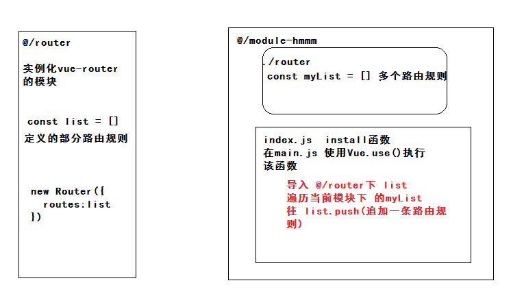

##团队实战-DAY10

### 问题答疑


####01-文章列表

- body需要发送 新密码和旧密码

接口文档错误


#### 02-api目录下的接口怎么使用

- 使用 this.list 不好使

在你的组件内是否有定义list函数，如果去使用api目录下的list函数，导入函数再使用，而且不需要使用this去调用。

```js
import {list} from '@/api/articles.js'
// list(请求对象)
```


####03-一些数据没有接口

常量数据 api/hmmm/constants.js

- 状态
- 难度
- 题型
- 方向
- 精品审核
- 发布状态

城市数据  api/hmmm/citys.js

- provinces()  获取所有城市的函数
- citys(城市名称）获取某一个城市下的所有地区


#### 04-项目结构

- 每个module-  文件中都有一个components文件,那么组件怎么封装?
  - 全局组件定义在 @/components 里面
  - 自己的功能模块的组件 定义在 module-hmmm/components

- @/router 和  没有module-模块中的router的关系




#### 05-ID怎么传

```js
export const remove = data => createAPI(`/questions/${data.id}`, 'delete', data)
```

使用这个接口：

```js
remove({id:'你是怎么操作内容就写什么内容的ID'，其他数据...})
```


####06-导入成员取别名

```JS
const {list as aList} from 'articles'
const {list as dList} from 'directorys'
```


####07-使用sass

- 安装 node-sass 提供sass编译的包
- 项目使用的是sass而不是less

```html
<style scoped lang="scss"></style>
```


